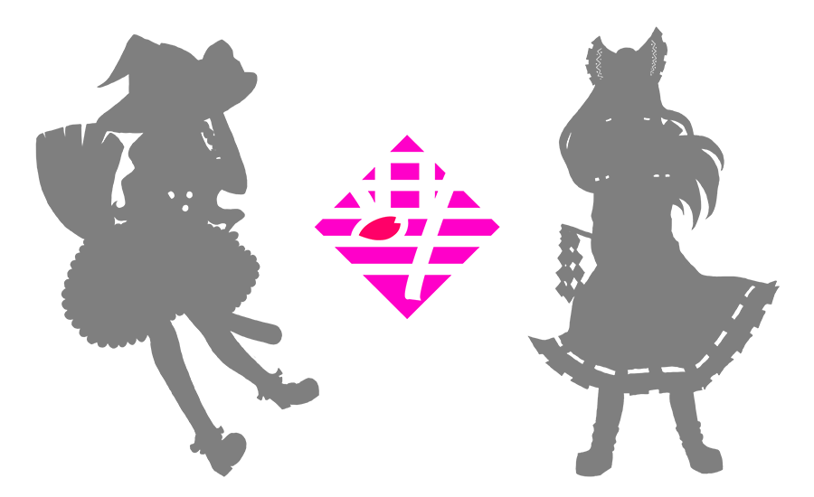

# Touhouonly


<!-- TABLE OF CONTENTS -->
<details open="open">
	<summary>Table of Contents</summary>
	<ol>
		<li>
			<a href="#about-touhouonly">About Touhouonly</a>
			<ul>
				<li><a href="#built-with">Built With</a></li>
				<li><a href="#angular-plugins">Angular Plugins</a></li>
			</ul>
		</li>
		<li><a href="#tree-view">Tree View</a></li>
		<li><a href="#license">License</a></li>
		<li><a href="#contact">Contact</a></li>
		<li><a href="#acknowledgements">Acknowledgements</a></li>
	</ol>
</details>

<!-- ABOUT Touhouonly -->
## About Touhouonly

This is a Touhou Comic Market website in Taiwan


> This project code is for study guideline purposes only.

_Web Site Link: [touonlyonly.com](https://touonlyonly.com)_

_Touhou Project on wiki: [Touhou Project](https://en.wikipedia.org/wiki/Touhou_Project)_


### Built With


### Angular Plugins


<!-- Tree View -->
## Tree View

```sh
🏠 touhouonly
│
│   [README.md]
│   [.htaccess] For server routing
│   [tsconfig.app.json] Types compiler options
│
└─── 📁 src
│   │   [styles.less] define fortawesome path
│   │   [index.html] Google Analytics code
│   │
│   └─── 📁 app
│   │   │
│   │   └─── 📁 @set
│   │   │   [event.ts] Annual event data
│   │   │   [page.ts] Year for routing
│   │   │   [set.const.ts] Year range and social link
│   │   │
│   │   └─── 📁 @sup
│   │   │   [date-week.service] Show date week (Not in used )
│   │   │   [event.service] Find event data by year
│   │   │
│   │   └─── 📁 @view
│   │   │   [footer] Copyright info.
│   │   │   [header] Header for each page
│   │   │   [logo] Touhouonly LOGO
│   │   │   [nav] User menu with mobile html
│   │   │
│   │   └─── 📁 index
│   │   │   [link] Social link
│   │   │   [main] Event info and Regulations
│   │   │   [year] Past event page list
│   │   │
│   │   └─── 📁 page
│   │   │   [about] About touhouonly and schedule
│   │   │   [club] Club registration
│   │   │   [coming] 404 page
│   │   │   [cosplay] Cosplay regulations
│   │   │   [location] Transportation info
│   │   │   [visitor] Visitor regulations
│   │   │
│   │   └─── 📁 stage
│   │   　   [2018] With special logo
│   │   　   [2020] With special logo
│   │   　   [2023] Event of this year
│   │
│   └─── 📁 assets
│   │   [lang] Language file (Only zh-tw available)
│   │
│   └─── 📁 environments
│   │   　  [environment.ts] (Not in used)
│   │
│   └─── 📁 less
│   　   │
│   　   └─── 📁 base
│   　   │   [btn] Buttons
│  　    │   [color] Variable setting
│   　   │   [dot] Flower or ice crystals
│   　   │   [global] Native tag
│   　   │   [headline] Headline in pages
│   　   │   [LessXD] Less library
│   　   │   [reset] Custom reset
│   　   │   [title] Title style
│  　    │
│  　    └─── 📁 page
│   　  　   [main] Page style
│
└─── 📁 images
　   [about.png] For markdown

```


<!-- LICENSE -->
## License

This project code is for study guideline purposes only.


<!-- CONTACT -->
## Contact

[](https%3A%2F%2Ftwitter.com%2Ftouhouonly_tw)
[](https%3A%2F%2Ffacebook.com%2FTouhouOnly)

<service@touhouonly.com>

<!-- ACKNOWLEDGEMENTS -->
## Acknowledgements
* [Img Shields](https://shields.io)
* [Emoji All](https://emojiall.com)
* [Markdown Guide](https://www.markdownguide.org)
* [Choose an Open Source License](https://choosealicense.com)
* [Touhou Project on wiki](https://en.wikipedia.org/wiki/Touhou_Project)
* [Best README Template](https://github.com/othneildrew/Best-README-Template)
* [Font Awesome](https://fontawesome.com)

